```
test> use college_nosql
switched to db college_nosql
college_nosql> d.createCollection('feedback')
ReferenceError: d is not defined
college_nosql> db.createCollection('feedback')
{ ok: 1 }
college_nosql> show dbs
admin          100.00 KiB
college_nosql    8.00 KiB
config          92.00 KiB
local           72.00 KiB
college_nosql> show collections
feedback
college_nosql> 
```
 **Task 1: Create the Collection and Insert Documents**

 ``` javascript
 use college_nosql
 switched to db college_nosql
 db["feedback"].find()
  
 db.feedback.insertMany([
   {
     student_id: 1,
     course_code: 'CS101',
     semester: '2026-ODD',
     rating: 4,
     comments: 'Excellent teaching. Would recommend.',
     tags: ['challenging', 'well-structured', 'good-examples'],
     submitted_at: new Date('2026-11-30T10:15:00Z'),
     attachments: [{ filename: 'name.pdf', size_kb: 240 }]
   },
   {
     student_id: 2,
     course_code: 'CS101',
     semester: '2026-ODD',
     rating: 5,
     comments: 'Best course this semester, very clear explanations.',
     tags: ['well-structured', 'engaging'],
     submitted_at: new Date('2026-11-30T11:00:00Z'),
     attachments: [{ filename: 'name1.pdf', size_kb: 85 }]
   },
   {
     student_id: 3,
     course_code: 'CS101',
     semester: '2026-EVEN',
     rating: 2,
     comments: 'Pace was too fast, hard to keep up with assignments.',
     tags: ['challenging', 'fast-paced'],
     submitted_at: new Date('2026-05-14T09:30:00Z'),
     attachments: [{ filename: 'name2.pdf', size_kb: 120 }]
   },
   {
     student_id: 4,
     course_code: 'CS102',
     semester: '2026-ODD',
     rating: 3,
     comments: 'Average course, could use more practical examples.',
     tags: ['average', 'needs-examples'],
     submitted_at: new Date('2026-11-29T14:20:00Z'),
     attachments: [{ filename: 'name3.pdf', size_kb: 300 }]
   },
   {
     student_id: 5,
     course_code: 'CS102',
     semester: '2026-EVEN',
     rating: 5,
     comments: 'Loved the hands-on labs and project work.',
     tags: ['hands-on', 'well-structured', 'good-examples'],
     submitted_at: new Date('2026-05-15T16:45:00Z'),
     attachments: [{ filename: 'name4.pdf', size_kb: 512 }]
   },
   {
     student_id: 6,
     course_code: 'CS103',
     semester: '2026-ODD',
     rating: 1,
     comments: 'Very disorganized, unclear grading criteria.',
     tags: ['disorganized', 'unclear-grading'],
     submitted_at: new Date('2026-11-28T08:10:00Z'),
     attachments: [{ filename: 'name5.pdf', size_kb: 45 }]
   },
   {
     student_id: 7,
     course_code: 'CS104',
     semester: '2026-EVEN',
     rating: 4,
     comments: 'Good balance of theory and practice.',
     tags: ['balanced', 'good-examples'],
     submitted_at: new Date('2026-05-16T10:05:00Z'),
     attachments: [{ filename: 'name6.pdf', size_kb: 190 }]
   },
   {
     student_id: 8,
     course_code: 'CS101',
     semester: '2026-EVEN',
     rating: 3,
     comments: 'Decent, but assignments were repetitive.',
     tags: ['repetitive', 'average'],
     submitted_at: new Date('2026-05-17T12:30:00Z'),
     attachments: [{ filename: 'name7.pdf', size_kb: 75 }]
   },
   {
     student_id: 9,
     course_code: 'CS105',
     semester: '2026-ODD',
     rating: 5,
     comments: 'Instructor was very approachable and helpful.',
     tags: ['engaging', 'well-structured'],
     submitted_at: new Date('2026-11-27T13:15:00Z'),
     attachments: [{ filename: 'name8.pdf', size_kb: 210 }]
   },
   {
     student_id: 10,
     course_code: 'CS102',
     semester: '2026-ODD',
     rating: 2,
     comments: 'Course content felt outdated compared to industry practice.',
     tags: ['outdated', 'needs-update'],
     submitted_at: new Date('2026-11-26T15:50:00Z'),
     attachments: [{ filename: 'name9.pdf', size_kb: 150 }]
   }
 ])
 {
   acknowledged: true,
   insertedIds: {
     '0': ObjectId('6a4e67fda029b2b3f8dee432'),
     '1': ObjectId('6a4e67fda029b2b3f8dee433'),
     '2': ObjectId('6a4e67fda029b2b3f8dee434'),
     '3': ObjectId('6a4e67fda029b2b3f8dee435'),
     '4': ObjectId('6a4e67fda029b2b3f8dee436'),
     '5': ObjectId('6a4e67fda029b2b3f8dee437'),
     '6': ObjectId('6a4e67fda029b2b3f8dee438'),
     '7': ObjectId('6a4e67fda029b2b3f8dee439'),
     '8': ObjectId('6a4e67fda029b2b3f8dee43a'),
     '9': ObjectId('6a4e67fda029b2b3f8dee43b')
   }
 }
 db.feedback.insertOne(
   {
     student_id: 11,
     course_code: 'CS101',
     semester: '2026-EVEN',
     rating: 4,
     comments: 'Solid course overall, enjoyed the assignments.',
     tags: ['well-structured', 'engaging'],
     submitted_at: new Date('2026-05-18T09:00:00Z')
   }
 )
 {
   acknowledged: true,
   insertedId: ObjectId('6a4e681da029b2b3f8dee43c')
 }
 db.feedback.countDocuments()
 11
 college_nosql
 
 ```

**Task 2: CRUD Operations**

 65. READ: Find all feedback documents where rating is 5.

 ```javascript
 db.feedback.find({rating:5})
 {
   _id: ObjectId('6a4e67fda029b2b3f8dee433'),
   student_id: 2,
   course_code: 'CS101',
   semester: '2026-ODD',
   rating: 5,
   comments: 'Best course this semester, very clear explanations.',
   tags: [
     'well-structured',
     'engaging'
   ],
   submitted_at: 2026-11-30T11:00:00.000Z,
   attachments: [
     {
       filename: 'name1.pdf',
       size_kb: 85
     }
   ]
 }
 {
   _id: ObjectId('6a4e67fda029b2b3f8dee436'),
   student_id: 5,
   course_code: 'CS102',
   semester: '2026-EVEN',
   rating: 5,
   comments: 'Loved the hands-on labs and project work.',
   tags: [
     'hands-on',
     'well-structured',
     'good-examples'
   ],
   submitted_at: 2026-05-15T16:45:00.000Z,
   attachments: [
     {
       filename: 'name4.pdf',
       size_kb: 512
     }
   ]
 }
 {
   _id: ObjectId('6a4e67fda029b2b3f8dee43a'),
   student_id: 9,
   course_code: 'CS105',
   semester: '2026-ODD',
   rating: 5,
   comments: 'Instructor was very approachable and helpful.',
   tags: [
     'engaging',
     'well-structured'
   ],
   submitted_at: 2026-11-27T13:15:00.000Z,
   attachments: [
     {
       filename: 'name8.pdf',
       size_kb: 210
     }
   ]
 }
 college_nosql
 
 

 ```

 66. READ: Find feedback for course CS101 where the tags array contains 'challenging'. Use $elemMatch or a simple array value query.

```javascript
db.feedback.find({course_code:'CS101',tags:'challenging'})
{
  _id: ObjectId('6a4e67fda029b2b3f8dee432'),
  student_id: 1,
  course_code: 'CS101',
  semester: '2026-ODD',
  rating: 4,
  comments: 'Excellent teaching. Would recommend.',
  tags: [
    'challenging',
    'well-structured',
    'good-examples'
  ],
  submitted_at: 2026-11-30T10:15:00.000Z,
  attachments: [
    {
      filename: 'name.pdf',
      size_kb: 240
    }
  ]
}
{
  _id: ObjectId('6a4e67fda029b2b3f8dee434'),
  student_id: 3,
  course_code: 'CS101',
  semester: '2026-EVEN',
  rating: 2,
  comments: 'Pace was too fast, hard to keep up with assignments.',
  tags: [
    'challenging',
    'fast-paced'
  ],
  submitted_at: 2026-05-14T09:30:00.000Z,
  attachments: [
    {
      filename: 'name2.pdf',
      size_kb: 120
    }
  ]
}
college_nosql
```

67. READ: Retrieve only the student_id, course_code, and rating fields (projection) for all documents —
exclude _id.

```javascript
db.feedback.find({},{student_id:1, course_code:1, rating:1, _id:0})
{
  student_id: 1,
  course_code: 'CS101',
  rating: 4
}
{
  student_id: 2,
  course_code: 'CS101',
  rating: 5
}
{
  student_id: 3,
  course_code: 'CS101',
  rating: 2
}
{
  student_id: 4,
  course_code: 'CS102',
  rating: 3
}
{
  student_id: 5,
  course_code: 'CS102',
  rating: 5
}
{
  student_id: 6,
  course_code: 'CS103',
  rating: 1
}
{
  student_id: 7,
  course_code: 'CS104',
  rating: 4
}
{
  student_id: 8,
  course_code: 'CS101',
  rating: 3
}
{
  student_id: 9,
  course_code: 'CS105',
  rating: 5
}
{
  student_id: 10,
  course_code: 'CS102',
  rating: 2
}
{
  student_id: 11,
  course_code: 'CS101',
  rating: 4
}
college_nosql


```

68. UPDATE: For all feedback documents with rating < 3, add a field needs_review: true using
updateMany and $set.

```javascript
db.feedback.updateMany({rating:{$lt: 3}},{$set:{needs_review:true}})
{
  acknowledged: true,
  insertedId: null,
  matchedCount: 3,
  modifiedCount: 3,
  upsertedCount: 0
}
college_nosql


```
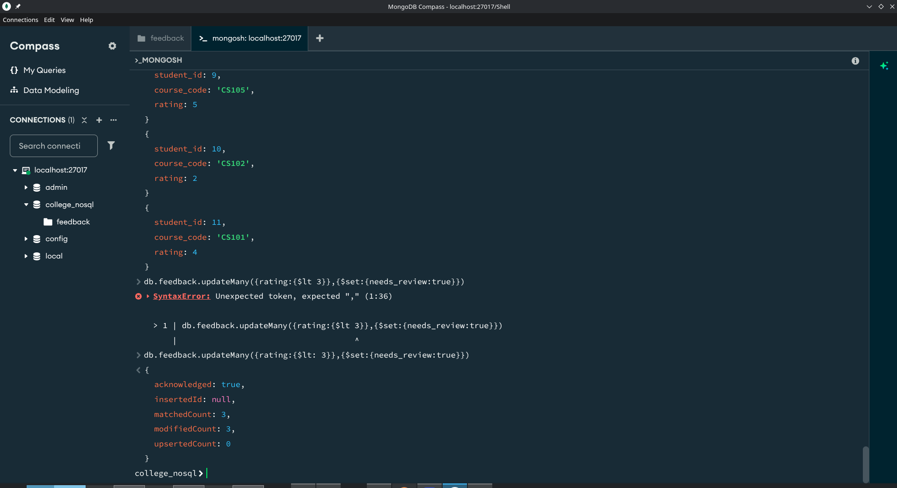


69. UPDATE: Push a new tag 'reviewed' into the tags array of all documents where needs_review is true,
using $push

```javascript
db.feedback.updateMany({needs_review:true},{$push:{tags:'reviewed'}})
{
  acknowledged: true,
  insertedId: null,
  matchedCount: 3,
  modifiedCount: 3,
  upsertedCount: 0
}
college_nosql


```
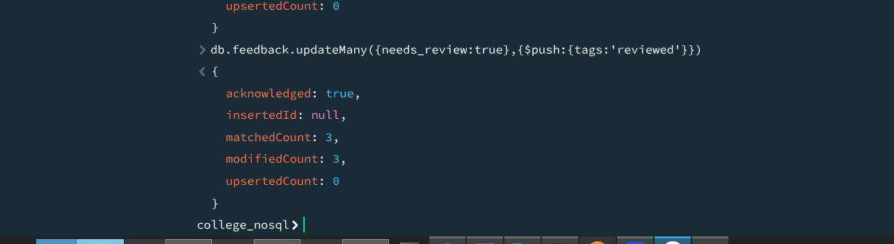

70. DELETE: Delete all feedback documents where the semester is '2021-EVEN'.

```javascript
db.feedback.deleteMany({semester:'2021-EVEN'})
{
  acknowledged: true,
  deletedCount: 0
}
college_nosql

```
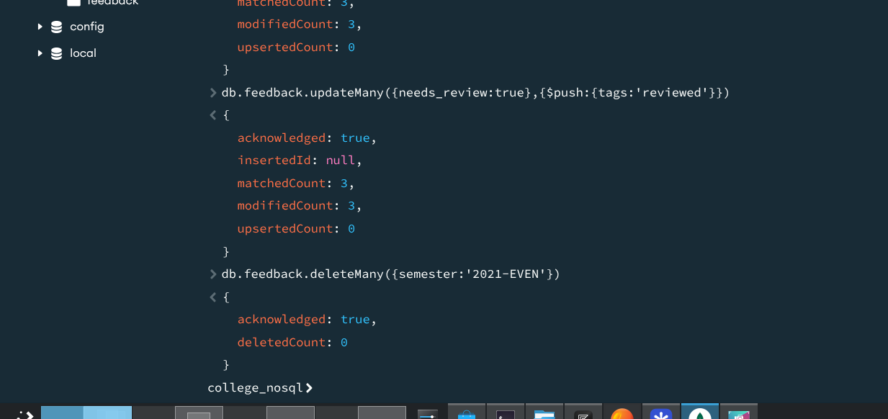

 **Task 3: Aggregation Pipeline**

71. Write a pipeline that: (Stage 1) filters to semester '2022-ODD'; (Stage 2) groups by course_code
calculating average rating and total feedback count; (Stage 3) sorts by average rating descending.

 ```javascript
 db.feedback.aggregate([
   {$match:{semester:'2022-ODD'}},
   {
     $group:{
       _id:'$course_code',
       avg_rating:{$avg:'$rating'},
       total_feedback:{$sum: 1}
     }
   },
   {
     $sort:{avg_salary:-1}
   },
   {
     $project:{
       _id:0,
       course_code:'$id',
       avg_salary:{$round:['$avg_rating',1]},
       total_feedback:1
     }
   }
 ])
 {
   total_feedback: 2,
   avg_salary: 4.5
 }
 {
   total_feedback: 1,
   avg_salary: 2
 }
 college_nosql

 ```

 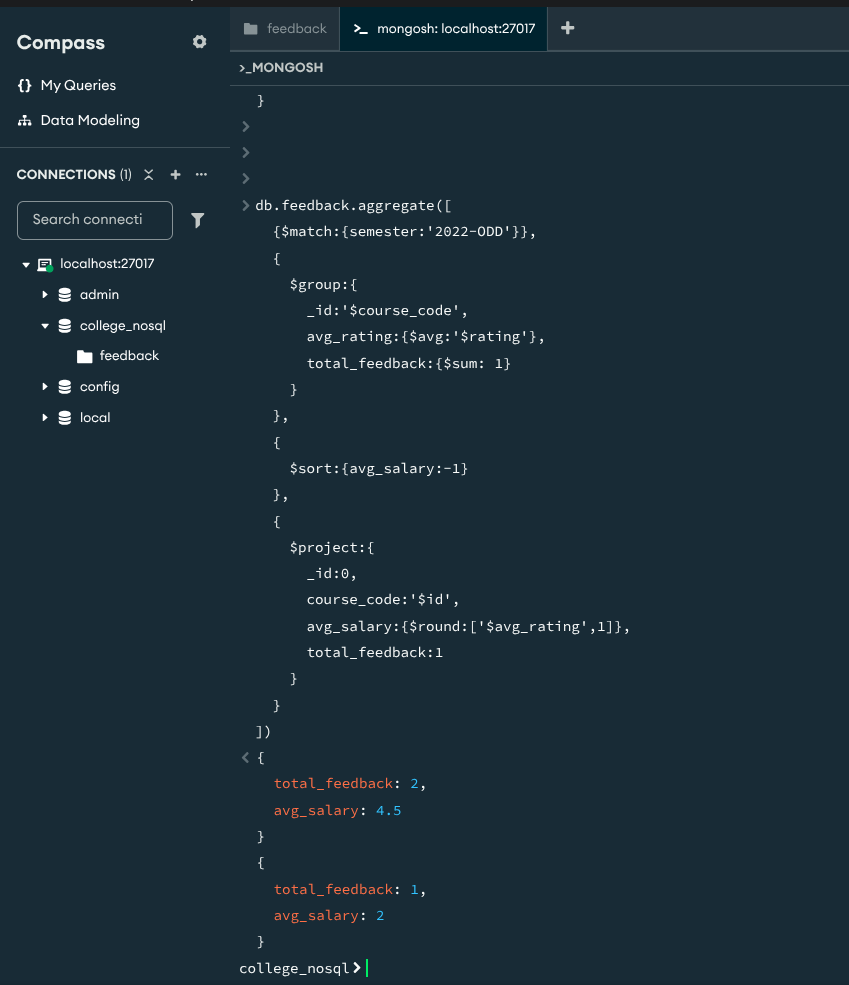

 72. Extend the pipeline with a $project stage to rename avg_rating to average_rating and round it to 1 decimal place using $round.

 ```javascript
 db.feedback.aggregate([
    {$match:{semester:'2022-ODD'}},
    {
      $group:{
        _id:'$course_code',
        avg_rating:{$avg:'$rating'},
        total_feedback:{$sum: 1}
      }
    },
    {
      $sort:{avg_salary:-1}
    },
    {
      $project:{
        _id:0,
        course_code:'$id',
        avg_salary:{$round:['$average_rating',1]},
        total_feedback:1
      }
    }
  ])
 {
   total_feedback: 2,
   avg_salary: null
 }
 {
   total_feedback: 1,
   avg_salary: null
 }
 college_nosql
 
 ```

  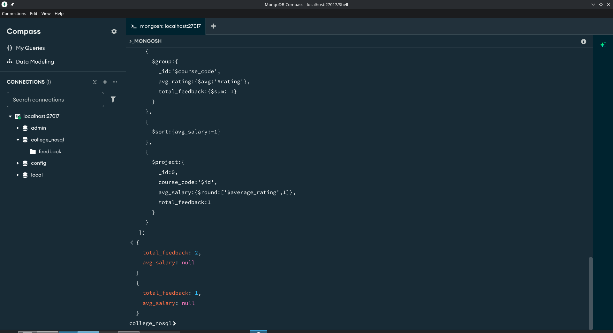


73. Write a pipeline that uses $unwind on the tags array, then $group by tag to count how many times
each tag appears. Sort by count descending — a tag frequency leaderboard.

```javascript
db.feedback.aggregate([
  {$unwind : '$tags'},
  {$group:{
  _id:'$tags',
    count:{$sum:1}
  }},
{
  $sort:{count:-1}
},
{
  $project:{
    _id:0,
      tag:'$_id',
      count:1
  }
}
])
{
  count: 5,
  tag: 'well-structured'
}
{
  count: 3,
  tag: 'good-examples'
}
{
  count: 3,
  tag: 'reviewed'
}
{
  count: 3,
  tag: 'engaging'
}
{
  count: 2,
  tag: 'challenging'
}
{
  count: 2,
  tag: 'average'
}
{
  count: 1,
  tag: 'balanced'
}
{
  count: 1,
  tag: 'repetitive'
}
{
  count: 1,
  tag: 'disorganized'
}
{
  count: 1,
  tag: 'unclear-grading'
}
{
  count: 1,
  tag: 'fast-paced'
}
{
  count: 1,
  tag: 'needs-update'
}
{
  count: 1,
  tag: 'outdated'
}
{
  count: 1,
  tag: 'hands-on'
}
{
  count: 1,
  tag: 'needs-examples'
}
college_nosql


```
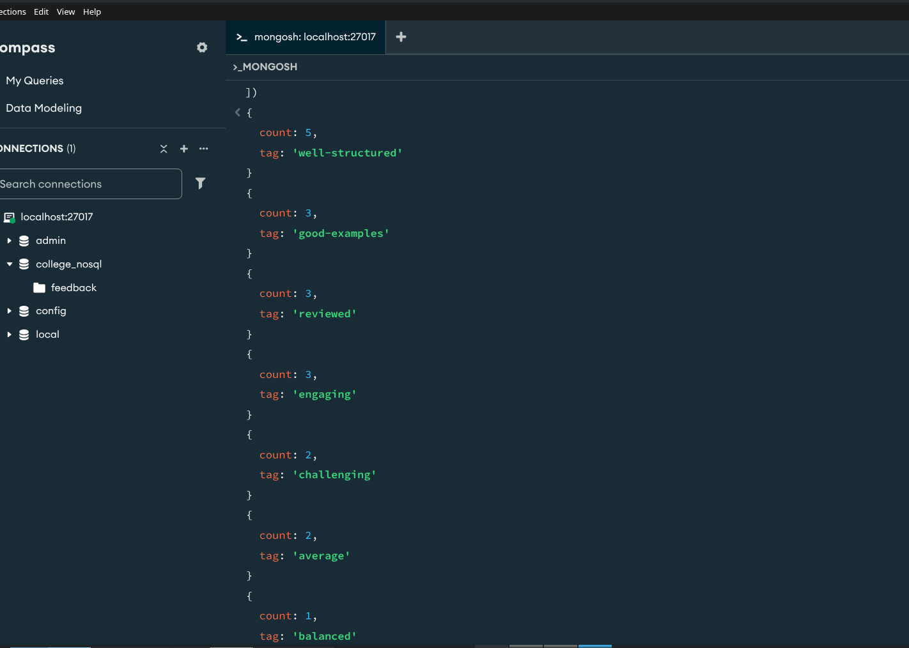
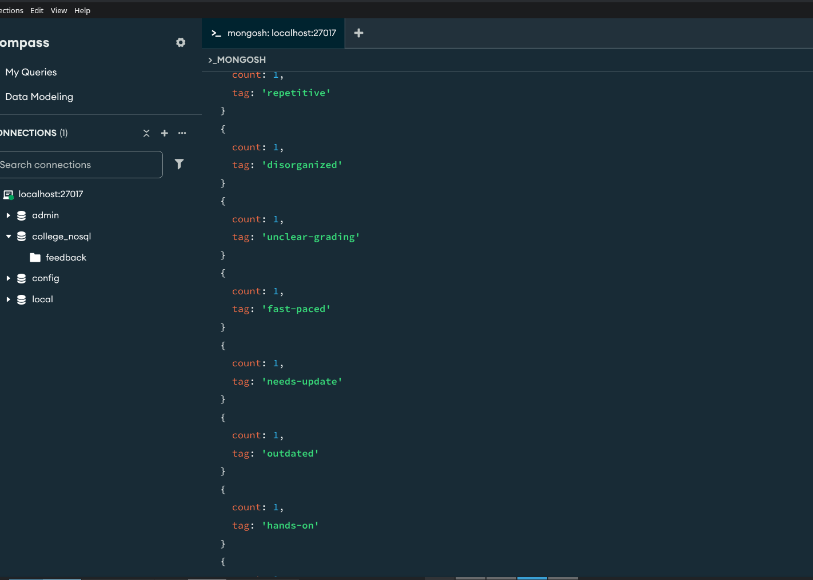


74. Add an index on course_code and verify its usage with
db.feedback.find({course_code:'CS101'}).explain('executionStats') — confirm the stage shows
IXSCAN not COLLSCAN.

```javascript
db.feedback.createIndex({course_code:1})
course_code_1
db.feedback.getIndexes()
[
  { v: 2, key: { _id: 1 }, name: '_id_' },
  { v: 2, key: { course_code: 1 }, name: 'course_code_1' }
]
db.feedback.find({course_code:'CS101'}).explain('executionStats')
{
      alreadyHasObj: 0,
      inputStage: {
        stage: 'IXSCAN',
        nReturned: 5,
        executionTimeMillisEstimate: 0,
        works: 6,
        advanced: 5,
        needTime: 0,
        needYield: 0,
        saveState: 0,
        restoreState: 0,
        isEOF: 1,
        keyPattern: {
          course_code: 1
        },
        indexName: 'course_code_1',
        isMultiKey: false,
        multiKeyPaths: {
          course_code: []
        },
        isUnique: false,
        isSparse: false,
        isPartial: false,
        indexVersion: 2,
        direction: 'forward',
        indexBounds: {
          course_code: [
            '["CS101", "CS101"]'
          ]
        },
        keysExamined: 5,
        seeks: 1,
        dupsTested: 0,
        dupsDropped: 0
      }
    }
  },
  queryShapeHash: 'A93905E9C9869DA0264D6D85BC8875D4C698F973B857E2ABAAA6A355A5FCF0CB',
  command: {
    find: 'feedback',
    filter: {
      course_code: 'CS101'
    },
    '$db': 'college_nosql'
  },
  serverInfo: {
    host: '54b5510d6dcd',
    port: 27017,
    version: '8.2.11',
    gitVersion: 'ee01d36638a00a07a6aa42ee80a125890f11aeed'
  },
  serverParameters: {
    internalQueryFacetBufferSizeBytes: 104857600,
    internalQueryFacetMaxOutputDocSizeBytes: 104857600,
    internalLookupStageIntermediateDocumentMaxSizeBytes: 104857600,
    internalDocumentSourceGroupMaxMemoryBytes: 104857600,
    internalQueryMaxBlockingSortMemoryUsageBytes: 104857600,
    internalQueryProhibitBlockingMergeOnMongoS: 0,
    internalQueryMaxAddToSetBytes: 104857600,
    internalDocumentSourceSetWindowFieldsMaxMemoryBytes: 104857600,
    internalQueryFrameworkControl: 'trySbeRestricted',
    internalQueryPlannerIgnoreIndexWithCollationForRegex: 1
  },
  ok: 1
}
college_nosql

```
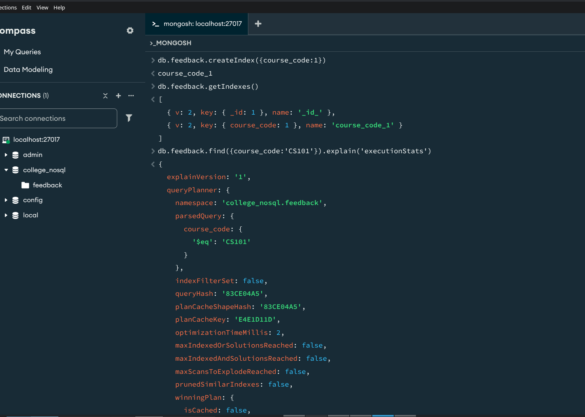
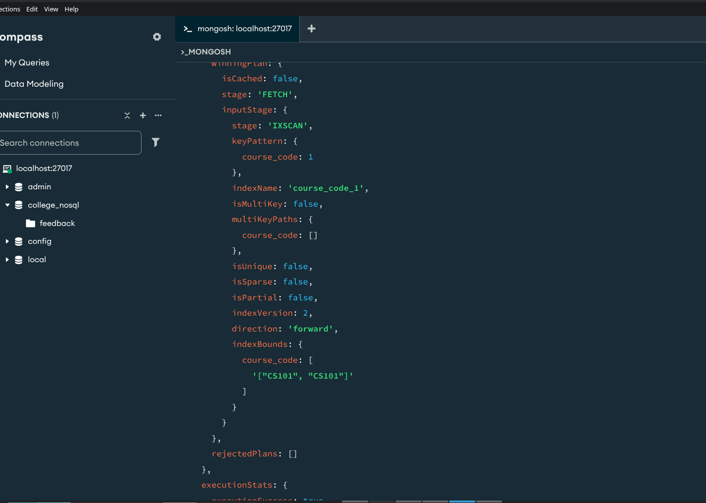
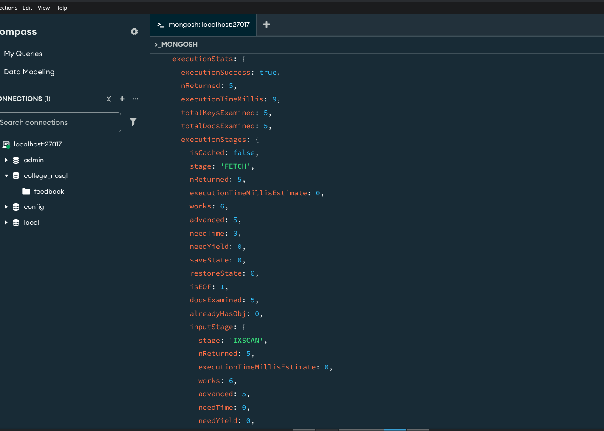
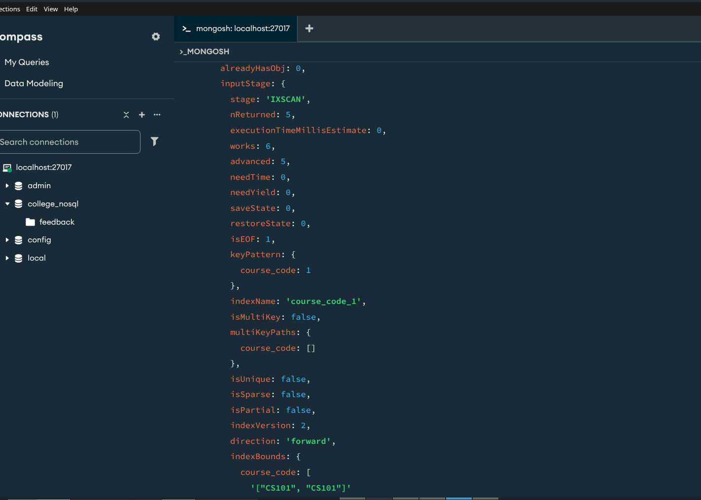
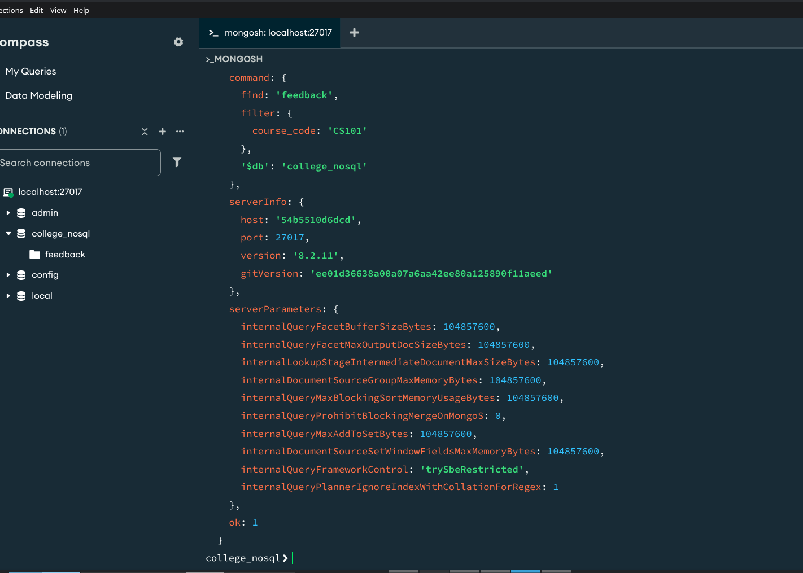
