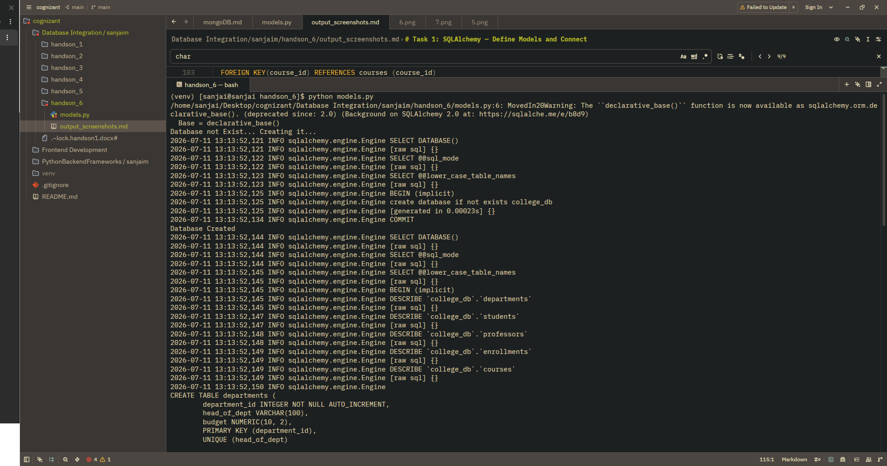
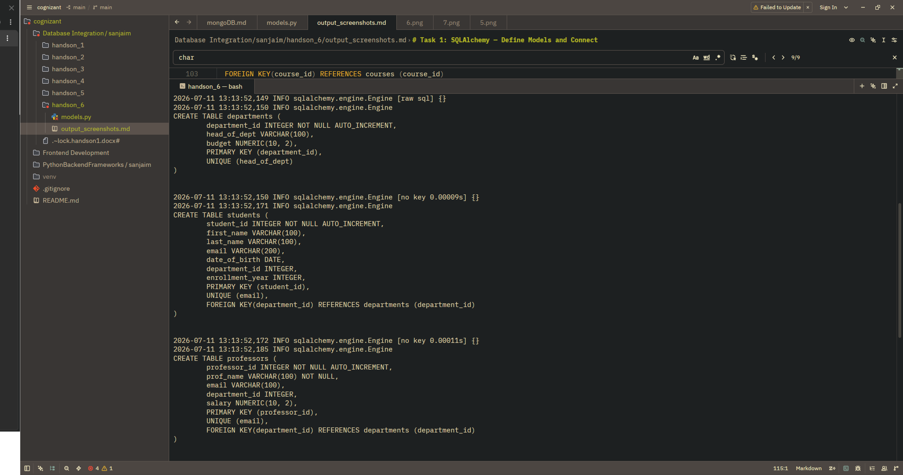
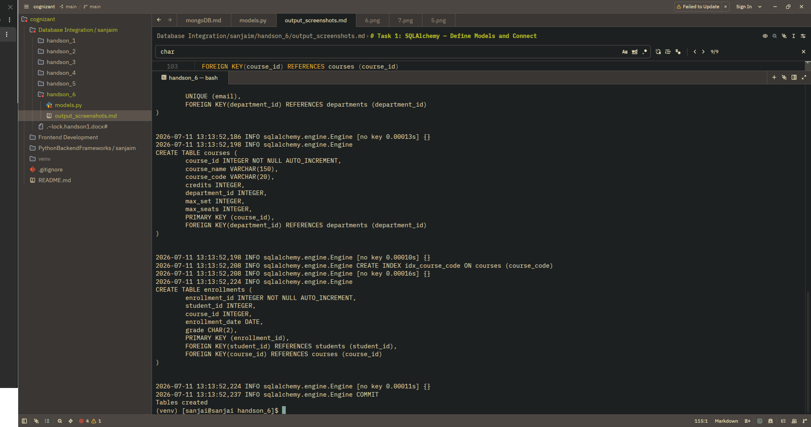

#  Task 1: SQLAlchemy — Define Models and Connect

```javascript
(venv) [sanjai@sanjai handson_6]$ python models.py
/home/sanjai/Desktop/cognizant/Database Integration/sanjaim/handson_6/models.py:6: MovedIn20Warning: The ``declarative_base()`` function is now available as sqlalchemy.orm.declarative_base(). (deprecated since: 2.0) (Background on SQLAlchemy 2.0 at: https://sqlalche.me/e/b8d9)
  Base = declarative_base()
Database not Exist... Creating it...
2026-07-11 13:13:52,121 INFO sqlalchemy.engine.Engine SELECT DATABASE()
2026-07-11 13:13:52,121 INFO sqlalchemy.engine.Engine [raw sql] {}
2026-07-11 13:13:52,122 INFO sqlalchemy.engine.Engine SELECT @@sql_mode
2026-07-11 13:13:52,122 INFO sqlalchemy.engine.Engine [raw sql] {}
2026-07-11 13:13:52,123 INFO sqlalchemy.engine.Engine SELECT @@lower_case_table_names
2026-07-11 13:13:52,123 INFO sqlalchemy.engine.Engine [raw sql] {}
2026-07-11 13:13:52,125 INFO sqlalchemy.engine.Engine BEGIN (implicit)
2026-07-11 13:13:52,125 INFO sqlalchemy.engine.Engine create database if not exists college_db
2026-07-11 13:13:52,125 INFO sqlalchemy.engine.Engine [generated in 0.00023s] {}
2026-07-11 13:13:52,134 INFO sqlalchemy.engine.Engine COMMIT
Database Created
2026-07-11 13:13:52,144 INFO sqlalchemy.engine.Engine SELECT DATABASE()
2026-07-11 13:13:52,144 INFO sqlalchemy.engine.Engine [raw sql] {}
2026-07-11 13:13:52,144 INFO sqlalchemy.engine.Engine SELECT @@sql_mode
2026-07-11 13:13:52,144 INFO sqlalchemy.engine.Engine [raw sql] {}
2026-07-11 13:13:52,145 INFO sqlalchemy.engine.Engine SELECT @@lower_case_table_names
2026-07-11 13:13:52,145 INFO sqlalchemy.engine.Engine [raw sql] {}
2026-07-11 13:13:52,145 INFO sqlalchemy.engine.Engine BEGIN (implicit)
2026-07-11 13:13:52,145 INFO sqlalchemy.engine.Engine DESCRIBE `college_db`.`departments`
2026-07-11 13:13:52,145 INFO sqlalchemy.engine.Engine [raw sql] {}
2026-07-11 13:13:52,147 INFO sqlalchemy.engine.Engine DESCRIBE `college_db`.`students`
2026-07-11 13:13:52,147 INFO sqlalchemy.engine.Engine [raw sql] {}
2026-07-11 13:13:52,148 INFO sqlalchemy.engine.Engine DESCRIBE `college_db`.`professors`
2026-07-11 13:13:52,148 INFO sqlalchemy.engine.Engine [raw sql] {}
2026-07-11 13:13:52,149 INFO sqlalchemy.engine.Engine DESCRIBE `college_db`.`enrollments`
2026-07-11 13:13:52,149 INFO sqlalchemy.engine.Engine [raw sql] {}
2026-07-11 13:13:52,149 INFO sqlalchemy.engine.Engine DESCRIBE `college_db`.`courses`
2026-07-11 13:13:52,149 INFO sqlalchemy.engine.Engine [raw sql] {}
2026-07-11 13:13:52,150 INFO sqlalchemy.engine.Engine
CREATE TABLE departments (
	department_id INTEGER NOT NULL AUTO_INCREMENT,
	head_of_dept VARCHAR(100),
	budget NUMERIC(10, 2),
	PRIMARY KEY (department_id),
	UNIQUE (head_of_dept)
)


2026-07-11 13:13:52,150 INFO sqlalchemy.engine.Engine [no key 0.00009s] {}
2026-07-11 13:13:52,171 INFO sqlalchemy.engine.Engine
CREATE TABLE students (
	student_id INTEGER NOT NULL AUTO_INCREMENT,
	first_name VARCHAR(100),
	last_name VARCHAR(100),
	email VARCHAR(200),
	date_of_birth DATE,
	department_id INTEGER,
	enrollment_year INTEGER,
	PRIMARY KEY (student_id),
	UNIQUE (email),
	FOREIGN KEY(department_id) REFERENCES departments (department_id)
)


2026-07-11 13:13:52,172 INFO sqlalchemy.engine.Engine [no key 0.00011s] {}
2026-07-11 13:13:52,185 INFO sqlalchemy.engine.Engine
CREATE TABLE professors (
	professor_id INTEGER NOT NULL AUTO_INCREMENT,
	prof_name VARCHAR(100) NOT NULL,
	email VARCHAR(100),
	department_id INTEGER,
	salary NUMERIC(10, 2),
	PRIMARY KEY (professor_id),
	UNIQUE (email),
	FOREIGN KEY(department_id) REFERENCES departments (department_id)
)


2026-07-11 13:13:52,186 INFO sqlalchemy.engine.Engine [no key 0.00013s] {}
2026-07-11 13:13:52,198 INFO sqlalchemy.engine.Engine
CREATE TABLE courses (
	course_id INTEGER NOT NULL AUTO_INCREMENT,
	course_name VARCHAR(150),
	course_code VARCHAR(20),
	credits INTEGER,
	department_id INTEGER,
	max_set INTEGER,
	max_seats INTEGER,
	PRIMARY KEY (course_id),
	FOREIGN KEY(department_id) REFERENCES departments (department_id)
)


2026-07-11 13:13:52,198 INFO sqlalchemy.engine.Engine [no key 0.00010s] {}
2026-07-11 13:13:52,208 INFO sqlalchemy.engine.Engine CREATE INDEX idx_course_code ON courses (course_code)
2026-07-11 13:13:52,208 INFO sqlalchemy.engine.Engine [no key 0.00016s] {}
2026-07-11 13:13:52,224 INFO sqlalchemy.engine.Engine
CREATE TABLE enrollments (
	enrollment_id INTEGER NOT NULL AUTO_INCREMENT,
	student_id INTEGER,
	course_id INTEGER,
	enrollment_date DATE,
	grade CHAR(2),
	PRIMARY KEY (enrollment_id),
	FOREIGN KEY(student_id) REFERENCES students (student_id),
	FOREIGN KEY(course_id) REFERENCES courses (course_id)
)


2026-07-11 13:13:52,224 INFO sqlalchemy.engine.Engine [no key 0.00011s] {}
2026-07-11 13:13:52,237 INFO sqlalchemy.engine.Engine COMMIT
Tables created
(venv) [sanjai@sanjai handson_6]$

```

**ScreenShots**


