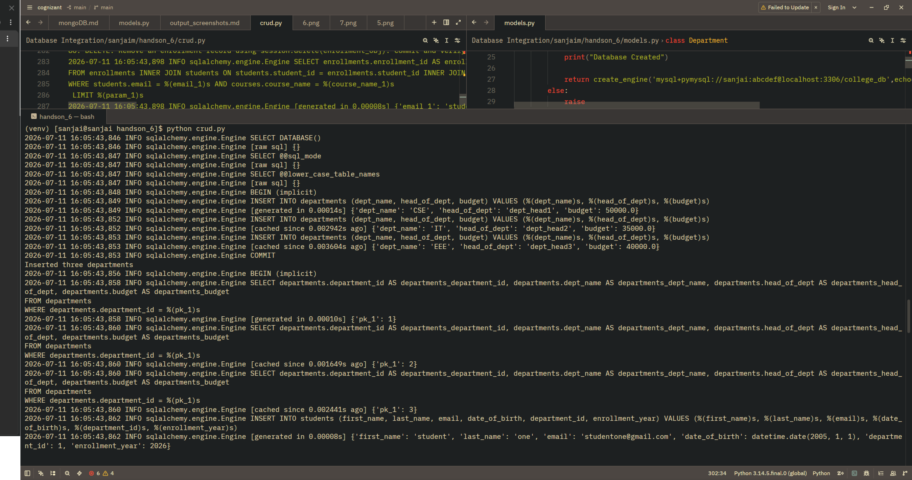
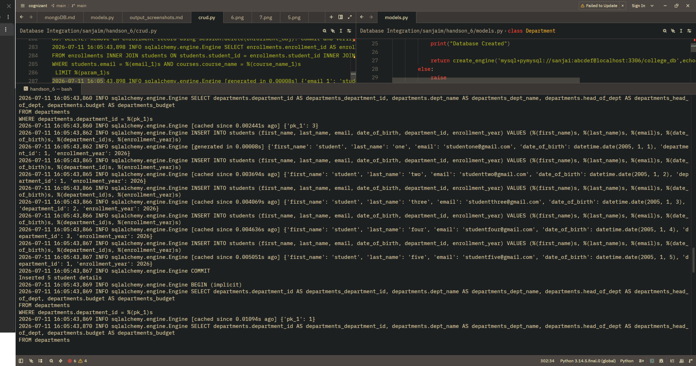
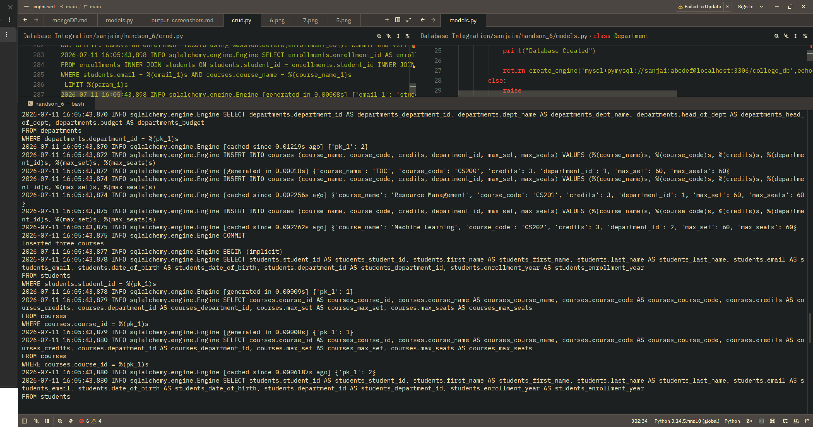
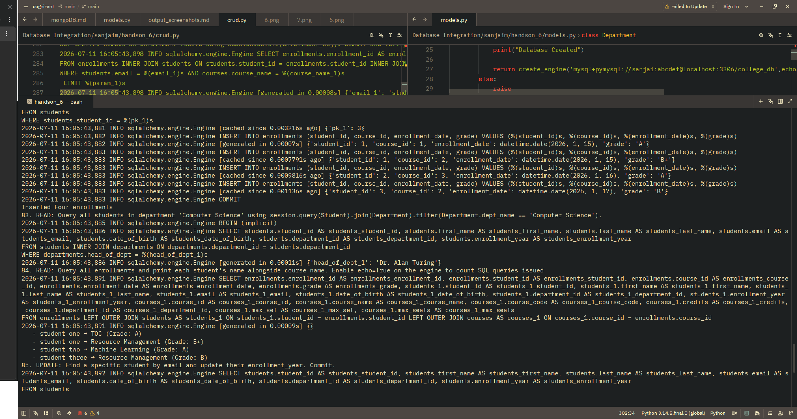
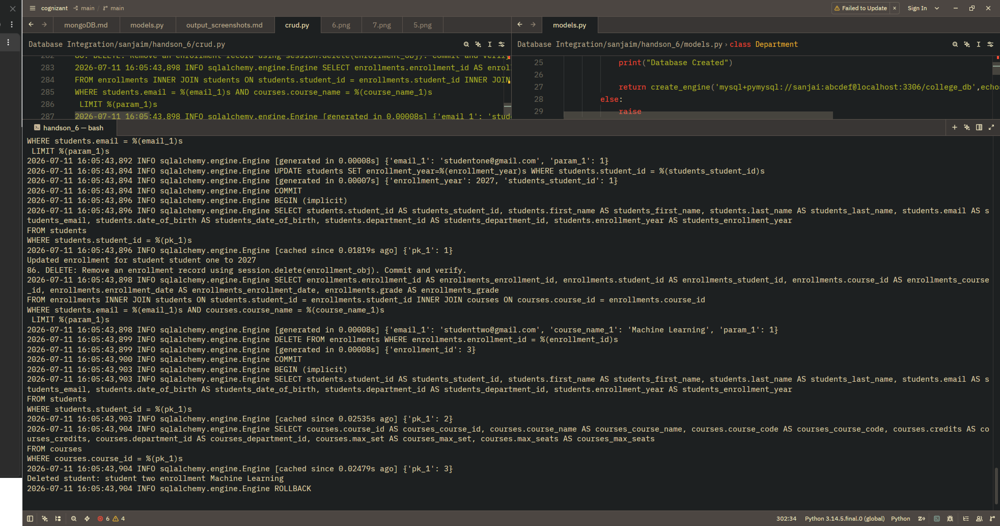

#  Task 1: SQLAlchemy — Define Models and Connect

```javascript
(venv) [sanjai@sanjai handson_6]$ python models.py
/home/sanjai/Desktop/cognizant/Database Integration/sanjaim/handson_6/models.py:6: MovedIn20Warning: The ``declarative_base()`` function is now available as sqlalchemy.orm.declarative_base(). (deprecated since: 2.0) (Background on SQLAlchemy 2.0 at: https://sqlalche.me/e/b8d9)
  Base = declarative_base()
Database not Exist... Creating it...
2026-07-11 13:13:52,121 INFO sqlalchemy.engine.Engine SELECT DATABASE()
2026-07-11 13:13:52,121 INFO sqlalchemy.engine.Engine [raw sql] {}
2026-07-11 13:13:52,122 INFO sqlalchemy.engine.Engine SELECT @@sql_mode
2026-07-11 13:13:52,122 INFO sqlalchemy.engine.Engine [raw sql] {}
2026-07-11 13:13:52,123 INFO sqlalchemy.engine.Engine SELECT @@lower_case_table_names
2026-07-11 13:13:52,123 INFO sqlalchemy.engine.Engine [raw sql] {}
2026-07-11 13:13:52,125 INFO sqlalchemy.engine.Engine BEGIN (implicit)
2026-07-11 13:13:52,125 INFO sqlalchemy.engine.Engine create database if not exists college_db
2026-07-11 13:13:52,125 INFO sqlalchemy.engine.Engine [generated in 0.00023s] {}
2026-07-11 13:13:52,134 INFO sqlalchemy.engine.Engine COMMIT
Database Created
2026-07-11 13:13:52,144 INFO sqlalchemy.engine.Engine SELECT DATABASE()
2026-07-11 13:13:52,144 INFO sqlalchemy.engine.Engine [raw sql] {}
2026-07-11 13:13:52,144 INFO sqlalchemy.engine.Engine SELECT @@sql_mode
2026-07-11 13:13:52,144 INFO sqlalchemy.engine.Engine [raw sql] {}
2026-07-11 13:13:52,145 INFO sqlalchemy.engine.Engine SELECT @@lower_case_table_names
2026-07-11 13:13:52,145 INFO sqlalchemy.engine.Engine [raw sql] {}
2026-07-11 13:13:52,145 INFO sqlalchemy.engine.Engine BEGIN (implicit)
2026-07-11 13:13:52,145 INFO sqlalchemy.engine.Engine DESCRIBE `college_db`.`departments`
2026-07-11 13:13:52,145 INFO sqlalchemy.engine.Engine [raw sql] {}
2026-07-11 13:13:52,147 INFO sqlalchemy.engine.Engine DESCRIBE `college_db`.`students`
2026-07-11 13:13:52,147 INFO sqlalchemy.engine.Engine [raw sql] {}
2026-07-11 13:13:52,148 INFO sqlalchemy.engine.Engine DESCRIBE `college_db`.`professors`
2026-07-11 13:13:52,148 INFO sqlalchemy.engine.Engine [raw sql] {}
2026-07-11 13:13:52,149 INFO sqlalchemy.engine.Engine DESCRIBE `college_db`.`enrollments`
2026-07-11 13:13:52,149 INFO sqlalchemy.engine.Engine [raw sql] {}
2026-07-11 13:13:52,149 INFO sqlalchemy.engine.Engine DESCRIBE `college_db`.`courses`
2026-07-11 13:13:52,149 INFO sqlalchemy.engine.Engine [raw sql] {}
2026-07-11 13:13:52,150 INFO sqlalchemy.engine.Engine
CREATE TABLE departments (
	department_id INTEGER NOT NULL AUTO_INCREMENT,
	head_of_dept VARCHAR(100),
	budget NUMERIC(10, 2),
	PRIMARY KEY (department_id),
	UNIQUE (head_of_dept)
)


2026-07-11 13:13:52,150 INFO sqlalchemy.engine.Engine [no key 0.00009s] {}
2026-07-11 13:13:52,171 INFO sqlalchemy.engine.Engine
CREATE TABLE students (
	student_id INTEGER NOT NULL AUTO_INCREMENT,
	first_name VARCHAR(100),
	last_name VARCHAR(100),
	email VARCHAR(200),
	date_of_birth DATE,
	department_id INTEGER,
	enrollment_year INTEGER,
	PRIMARY KEY (student_id),
	UNIQUE (email),
	FOREIGN KEY(department_id) REFERENCES departments (department_id)
)


2026-07-11 13:13:52,172 INFO sqlalchemy.engine.Engine [no key 0.00011s] {}
2026-07-11 13:13:52,185 INFO sqlalchemy.engine.Engine
CREATE TABLE professors (
	professor_id INTEGER NOT NULL AUTO_INCREMENT,
	prof_name VARCHAR(100) NOT NULL,
	email VARCHAR(100),
	department_id INTEGER,
	salary NUMERIC(10, 2),
	PRIMARY KEY (professor_id),
	UNIQUE (email),
	FOREIGN KEY(department_id) REFERENCES departments (department_id)
)


2026-07-11 13:13:52,186 INFO sqlalchemy.engine.Engine [no key 0.00013s] {}
2026-07-11 13:13:52,198 INFO sqlalchemy.engine.Engine
CREATE TABLE courses (
	course_id INTEGER NOT NULL AUTO_INCREMENT,
	course_name VARCHAR(150),
	course_code VARCHAR(20),
	credits INTEGER,
	department_id INTEGER,
	max_set INTEGER,
	max_seats INTEGER,
	PRIMARY KEY (course_id),
	FOREIGN KEY(department_id) REFERENCES departments (department_id)
)


2026-07-11 13:13:52,198 INFO sqlalchemy.engine.Engine [no key 0.00010s] {}
2026-07-11 13:13:52,208 INFO sqlalchemy.engine.Engine CREATE INDEX idx_course_code ON courses (course_code)
2026-07-11 13:13:52,208 INFO sqlalchemy.engine.Engine [no key 0.00016s] {}
2026-07-11 13:13:52,224 INFO sqlalchemy.engine.Engine
CREATE TABLE enrollments (
	enrollment_id INTEGER NOT NULL AUTO_INCREMENT,
	student_id INTEGER,
	course_id INTEGER,
	enrollment_date DATE,
	grade CHAR(2),
	PRIMARY KEY (enrollment_id),
	FOREIGN KEY(student_id) REFERENCES students (student_id),
	FOREIGN KEY(course_id) REFERENCES courses (course_id)
)


2026-07-11 13:13:52,224 INFO sqlalchemy.engine.Engine [no key 0.00011s] {}
2026-07-11 13:13:52,237 INFO sqlalchemy.engine.Engine COMMIT
Tables created
(venv) [sanjai@sanjai handson_6]$

```

**ScreenShots**


**Task 2: CRUD Operations via ORM**

```
(venv) [sanjai@sanjai handson_6]$ python crud.py
2026-07-11 16:05:43,846 INFO sqlalchemy.engine.Engine SELECT DATABASE()
2026-07-11 16:05:43,846 INFO sqlalchemy.engine.Engine [raw sql] {}
2026-07-11 16:05:43,847 INFO sqlalchemy.engine.Engine SELECT @@sql_mode
2026-07-11 16:05:43,847 INFO sqlalchemy.engine.Engine [raw sql] {}
2026-07-11 16:05:43,847 INFO sqlalchemy.engine.Engine SELECT @@lower_case_table_names
2026-07-11 16:05:43,847 INFO sqlalchemy.engine.Engine [raw sql] {}
2026-07-11 16:05:43,848 INFO sqlalchemy.engine.Engine BEGIN (implicit)
2026-07-11 16:05:43,849 INFO sqlalchemy.engine.Engine INSERT INTO departments (dept_name, head_of_dept, budget) VALUES (%(dept_name)s, %(head_of_dept)s, %(budget)s)
2026-07-11 16:05:43,849 INFO sqlalchemy.engine.Engine [generated in 0.00014s] {'dept_name': 'CSE', 'head_of_dept': 'dept_head1', 'budget': 50000.0}
2026-07-11 16:05:43,852 INFO sqlalchemy.engine.Engine INSERT INTO departments (dept_name, head_of_dept, budget) VALUES (%(dept_name)s, %(head_of_dept)s, %(budget)s)
2026-07-11 16:05:43,852 INFO sqlalchemy.engine.Engine [cached since 0.002942s ago] {'dept_name': 'IT', 'head_of_dept': 'dept_head2', 'budget': 35000.0}
2026-07-11 16:05:43,853 INFO sqlalchemy.engine.Engine INSERT INTO departments (dept_name, head_of_dept, budget) VALUES (%(dept_name)s, %(head_of_dept)s, %(budget)s)
2026-07-11 16:05:43,853 INFO sqlalchemy.engine.Engine [cached since 0.003604s ago] {'dept_name': 'EEE', 'head_of_dept': 'dept_head3', 'budget': 40000.0}
2026-07-11 16:05:43,853 INFO sqlalchemy.engine.Engine COMMIT
Inserted three departments
2026-07-11 16:05:43,856 INFO sqlalchemy.engine.Engine BEGIN (implicit)
2026-07-11 16:05:43,858 INFO sqlalchemy.engine.Engine SELECT departments.department_id AS departments_department_id, departments.dept_name AS departments_dept_name, departments.head_of_dept AS departments_head_of_dept, departments.budget AS departments_budget
FROM departments
WHERE departments.department_id = %(pk_1)s
2026-07-11 16:05:43,858 INFO sqlalchemy.engine.Engine [generated in 0.00010s] {'pk_1': 1}
2026-07-11 16:05:43,860 INFO sqlalchemy.engine.Engine SELECT departments.department_id AS departments_department_id, departments.dept_name AS departments_dept_name, departments.head_of_dept AS departments_head_of_dept, departments.budget AS departments_budget
FROM departments
WHERE departments.department_id = %(pk_1)s
2026-07-11 16:05:43,860 INFO sqlalchemy.engine.Engine [cached since 0.001649s ago] {'pk_1': 2}
2026-07-11 16:05:43,860 INFO sqlalchemy.engine.Engine SELECT departments.department_id AS departments_department_id, departments.dept_name AS departments_dept_name, departments.head_of_dept AS departments_head_of_dept, departments.budget AS departments_budget
FROM departments
WHERE departments.department_id = %(pk_1)s
2026-07-11 16:05:43,860 INFO sqlalchemy.engine.Engine [cached since 0.002441s ago] {'pk_1': 3}
2026-07-11 16:05:43,862 INFO sqlalchemy.engine.Engine INSERT INTO students (first_name, last_name, email, date_of_birth, department_id, enrollment_year) VALUES (%(first_name)s, %(last_name)s, %(email)s, %(date_of_birth)s, %(department_id)s, %(enrollment_year)s)
2026-07-11 16:05:43,862 INFO sqlalchemy.engine.Engine [generated in 0.00008s] {'first_name': 'student', 'last_name': 'one', 'email': 'studentone@gmail.com', 'date_of_birth': datetime.date(2005, 1, 1), 'department_id': 1, 'enrollment_year': 2026}
2026-07-11 16:05:43,865 INFO sqlalchemy.engine.Engine INSERT INTO students (first_name, last_name, email, date_of_birth, department_id, enrollment_year) VALUES (%(first_name)s, %(last_name)s, %(email)s, %(date_of_birth)s, %(department_id)s, %(enrollment_year)s)
2026-07-11 16:05:43,865 INFO sqlalchemy.engine.Engine [cached since 0.003694s ago] {'first_name': 'student', 'last_name': 'two', 'email': 'studenttwo@gmail.com', 'date_of_birth': datetime.date(2005, 1, 2), 'department_id': 1, 'enrollment_year': 2026}
2026-07-11 16:05:43,866 INFO sqlalchemy.engine.Engine INSERT INTO students (first_name, last_name, email, date_of_birth, department_id, enrollment_year) VALUES (%(first_name)s, %(last_name)s, %(email)s, %(date_of_birth)s, %(department_id)s, %(enrollment_year)s)
2026-07-11 16:05:43,866 INFO sqlalchemy.engine.Engine [cached since 0.004069s ago] {'first_name': 'student', 'last_name': 'three', 'email': 'studentthree@gmail.com', 'date_of_birth': datetime.date(2005, 1, 3), 'department_id': 2, 'enrollment_year': 2026}
2026-07-11 16:05:43,866 INFO sqlalchemy.engine.Engine INSERT INTO students (first_name, last_name, email, date_of_birth, department_id, enrollment_year) VALUES (%(first_name)s, %(last_name)s, %(email)s, %(date_of_birth)s, %(department_id)s, %(enrollment_year)s)
2026-07-11 16:05:43,866 INFO sqlalchemy.engine.Engine [cached since 0.004636s ago] {'first_name': 'student', 'last_name': 'four', 'email': 'studentfour@gmail.com', 'date_of_birth': datetime.date(2005, 1, 4), 'department_id': 3, 'enrollment_year': 2026}
2026-07-11 16:05:43,867 INFO sqlalchemy.engine.Engine INSERT INTO students (first_name, last_name, email, date_of_birth, department_id, enrollment_year) VALUES (%(first_name)s, %(last_name)s, %(email)s, %(date_of_birth)s, %(department_id)s, %(enrollment_year)s)
2026-07-11 16:05:43,867 INFO sqlalchemy.engine.Engine [cached since 0.005051s ago] {'first_name': 'student', 'last_name': 'five', 'email': 'studentfive@gmail.com', 'date_of_birth': datetime.date(2005, 1, 5), 'department_id': 1, 'enrollment_year': 2026}
2026-07-11 16:05:43,867 INFO sqlalchemy.engine.Engine COMMIT
Inserted 5 student details
2026-07-11 16:05:43,869 INFO sqlalchemy.engine.Engine BEGIN (implicit)
2026-07-11 16:05:43,869 INFO sqlalchemy.engine.Engine SELECT departments.department_id AS departments_department_id, departments.dept_name AS departments_dept_name, departments.head_of_dept AS departments_head_of_dept, departments.budget AS departments_budget
FROM departments
WHERE departments.department_id = %(pk_1)s
2026-07-11 16:05:43,869 INFO sqlalchemy.engine.Engine [cached since 0.01094s ago] {'pk_1': 1}
2026-07-11 16:05:43,870 INFO sqlalchemy.engine.Engine SELECT departments.department_id AS departments_department_id, departments.dept_name AS departments_dept_name, departments.head_of_dept AS departments_head_of_dept, departments.budget AS departments_budget
FROM departments
WHERE departments.department_id = %(pk_1)s
2026-07-11 16:05:43,870 INFO sqlalchemy.engine.Engine [cached since 0.01219s ago] {'pk_1': 2}
2026-07-11 16:05:43,872 INFO sqlalchemy.engine.Engine INSERT INTO courses (course_name, course_code, credits, department_id, max_set, max_seats) VALUES (%(course_name)s, %(course_code)s, %(credits)s, %(department_id)s, %(max_set)s, %(max_seats)s)
2026-07-11 16:05:43,872 INFO sqlalchemy.engine.Engine [generated in 0.00018s] {'course_name': 'TOC', 'course_code': 'CS200', 'credits': 3, 'department_id': 1, 'max_set': 60, 'max_seats': 60}
2026-07-11 16:05:43,874 INFO sqlalchemy.engine.Engine INSERT INTO courses (course_name, course_code, credits, department_id, max_set, max_seats) VALUES (%(course_name)s, %(course_code)s, %(credits)s, %(department_id)s, %(max_set)s, %(max_seats)s)
2026-07-11 16:05:43,874 INFO sqlalchemy.engine.Engine [cached since 0.002256s ago] {'course_name': 'Resource Management', 'course_code': 'CS201', 'credits': 3, 'department_id': 1, 'max_set': 60, 'max_seats': 60}
2026-07-11 16:05:43,875 INFO sqlalchemy.engine.Engine INSERT INTO courses (course_name, course_code, credits, department_id, max_set, max_seats) VALUES (%(course_name)s, %(course_code)s, %(credits)s, %(department_id)s, %(max_set)s, %(max_seats)s)
2026-07-11 16:05:43,875 INFO sqlalchemy.engine.Engine [cached since 0.002762s ago] {'course_name': 'Machine Learning', 'course_code': 'CS202', 'credits': 3, 'department_id': 2, 'max_set': 60, 'max_seats': 60}
2026-07-11 16:05:43,875 INFO sqlalchemy.engine.Engine COMMIT
Inserted three courses
2026-07-11 16:05:43,877 INFO sqlalchemy.engine.Engine BEGIN (implicit)
2026-07-11 16:05:43,878 INFO sqlalchemy.engine.Engine SELECT students.student_id AS students_student_id, students.first_name AS students_first_name, students.last_name AS students_last_name, students.email AS students_email, students.date_of_birth AS students_date_of_birth, students.department_id AS students_department_id, students.enrollment_year AS students_enrollment_year
FROM students
WHERE students.student_id = %(pk_1)s
2026-07-11 16:05:43,878 INFO sqlalchemy.engine.Engine [generated in 0.00009s] {'pk_1': 1}
2026-07-11 16:05:43,879 INFO sqlalchemy.engine.Engine SELECT courses.course_id AS courses_course_id, courses.course_name AS courses_course_name, courses.course_code AS courses_course_code, courses.credits AS courses_credits, courses.department_id AS courses_department_id, courses.max_set AS courses_max_set, courses.max_seats AS courses_max_seats
FROM courses
WHERE courses.course_id = %(pk_1)s
2026-07-11 16:05:43,879 INFO sqlalchemy.engine.Engine [generated in 0.00008s] {'pk_1': 1}
2026-07-11 16:05:43,880 INFO sqlalchemy.engine.Engine SELECT courses.course_id AS courses_course_id, courses.course_name AS courses_course_name, courses.course_code AS courses_course_code, courses.credits AS courses_credits, courses.department_id AS courses_department_id, courses.max_set AS courses_max_set, courses.max_seats AS courses_max_seats
FROM courses
WHERE courses.course_id = %(pk_1)s
2026-07-11 16:05:43,880 INFO sqlalchemy.engine.Engine [cached since 0.0006187s ago] {'pk_1': 2}
2026-07-11 16:05:43,880 INFO sqlalchemy.engine.Engine SELECT students.student_id AS students_student_id, students.first_name AS students_first_name, students.last_name AS students_last_name, students.email AS students_email, students.date_of_birth AS students_date_of_birth, students.department_id AS students_department_id, students.enrollment_year AS students_enrollment_year
FROM students
WHERE students.student_id = %(pk_1)s
2026-07-11 16:05:43,880 INFO sqlalchemy.engine.Engine [cached since 0.002374s ago] {'pk_1': 2}
2026-07-11 16:05:43,881 INFO sqlalchemy.engine.Engine SELECT courses.course_id AS courses_course_id, courses.course_name AS courses_course_name, courses.course_code AS courses_course_code, courses.credits AS courses_credits, courses.department_id AS courses_department_id, courses.max_set AS courses_max_set, courses.max_seats AS courses_max_seats
FROM courses
WHERE courses.course_id = %(pk_1)s
2026-07-11 16:05:43,881 INFO sqlalchemy.engine.Engine [cached since 0.001526s ago] {'pk_1': 3}
2026-07-11 16:05:43,881 INFO sqlalchemy.engine.Engine SELECT students.student_id AS students_student_id, students.first_name AS students_first_name, students.last_name AS students_last_name, students.email AS students_email, students.date_of_birth AS students_date_of_birth, students.department_id AS students_department_id, students.enrollment_year AS students_enrollment_year
FROM students
WHERE students.student_id = %(pk_1)s
2026-07-11 16:05:43,881 INFO sqlalchemy.engine.Engine [cached since 0.003216s ago] {'pk_1': 3}
2026-07-11 16:05:43,882 INFO sqlalchemy.engine.Engine INSERT INTO enrollments (student_id, course_id, enrollment_date, grade) VALUES (%(student_id)s, %(course_id)s, %(enrollment_date)s, %(grade)s)
2026-07-11 16:05:43,882 INFO sqlalchemy.engine.Engine [generated in 0.00007s] {'student_id': 1, 'course_id': 1, 'enrollment_date': datetime.date(2026, 1, 15), 'grade': 'A'}
2026-07-11 16:05:43,883 INFO sqlalchemy.engine.Engine INSERT INTO enrollments (student_id, course_id, enrollment_date, grade) VALUES (%(student_id)s, %(course_id)s, %(enrollment_date)s, %(grade)s)
2026-07-11 16:05:43,883 INFO sqlalchemy.engine.Engine [cached since 0.0007791s ago] {'student_id': 1, 'course_id': 2, 'enrollment_date': datetime.date(2026, 1, 15), 'grade': 'B+'}
2026-07-11 16:05:43,883 INFO sqlalchemy.engine.Engine INSERT INTO enrollments (student_id, course_id, enrollment_date, grade) VALUES (%(student_id)s, %(course_id)s, %(enrollment_date)s, %(grade)s)
2026-07-11 16:05:43,883 INFO sqlalchemy.engine.Engine [cached since 0.0009816s ago] {'student_id': 2, 'course_id': 3, 'enrollment_date': datetime.date(2026, 1, 16), 'grade': 'A'}
2026-07-11 16:05:43,883 INFO sqlalchemy.engine.Engine INSERT INTO enrollments (student_id, course_id, enrollment_date, grade) VALUES (%(student_id)s, %(course_id)s, %(enrollment_date)s, %(grade)s)
2026-07-11 16:05:43,883 INFO sqlalchemy.engine.Engine [cached since 0.001136s ago] {'student_id': 3, 'course_id': 2, 'enrollment_date': datetime.date(2026, 1, 17), 'grade': 'B'}
2026-07-11 16:05:43,883 INFO sqlalchemy.engine.Engine COMMIT
Inserted Four enrollments
83. READ: Query all students in department 'Computer Science' using session.query(Student).join(Department).filter(Department.dept_name == 'Computer Science').
2026-07-11 16:05:43,885 INFO sqlalchemy.engine.Engine BEGIN (implicit)
2026-07-11 16:05:43,886 INFO sqlalchemy.engine.Engine SELECT students.student_id AS students_student_id, students.first_name AS students_first_name, students.last_name AS students_last_name, students.email AS students_email, students.date_of_birth AS students_date_of_birth, students.department_id AS students_department_id, students.enrollment_year AS students_enrollment_year
FROM students INNER JOIN departments ON departments.department_id = students.department_id
WHERE departments.head_of_dept = %(head_of_dept_1)s
2026-07-11 16:05:43,886 INFO sqlalchemy.engine.Engine [generated in 0.00011s] {'head_of_dept_1': 'Dr. Alan Turing'}
84. READ: Query all enrollments and print each student's name alongside course name. Enable echo=True on the engine to count SQL queries issued
2026-07-11 16:05:43,891 INFO sqlalchemy.engine.Engine SELECT enrollments.enrollment_id AS enrollments_enrollment_id, enrollments.student_id AS enrollments_student_id, enrollments.course_id AS enrollments_course_id, enrollments.enrollment_date AS enrollments_enrollment_date, enrollments.grade AS enrollments_grade, students_1.student_id AS students_1_student_id, students_1.first_name AS students_1_first_name, students_1.last_name AS students_1_last_name, students_1.email AS students_1_email, students_1.date_of_birth AS students_1_date_of_birth, students_1.department_id AS students_1_department_id, students_1.enrollment_year AS students_1_enrollment_year, courses_1.course_id AS courses_1_course_id, courses_1.course_name AS courses_1_course_name, courses_1.course_code AS courses_1_course_code, courses_1.credits AS courses_1_credits, courses_1.department_id AS courses_1_department_id, courses_1.max_set AS courses_1_max_set, courses_1.max_seats AS courses_1_max_seats
FROM enrollments LEFT OUTER JOIN students AS students_1 ON students_1.student_id = enrollments.student_id LEFT OUTER JOIN courses AS courses_1 ON courses_1.course_id = enrollments.course_id
2026-07-11 16:05:43,891 INFO sqlalchemy.engine.Engine [generated in 0.00009s] {}
   - student one → TOC (Grade: A)
   - student one → Resource Management (Grade: B+)
   - student two → Machine Learning (Grade: A)
   - student three → Resource Management (Grade: B)
85. UPDATE: Find a specific student by email and update their enrollment_year. Commit.
2026-07-11 16:05:43,892 INFO sqlalchemy.engine.Engine SELECT students.student_id AS students_student_id, students.first_name AS students_first_name, students.last_name AS students_last_name, students.email AS students_email, students.date_of_birth AS students_date_of_birth, students.department_id AS students_department_id, students.enrollment_year AS students_enrollment_year
FROM students
WHERE students.email = %(email_1)s
 LIMIT %(param_1)s
2026-07-11 16:05:43,892 INFO sqlalchemy.engine.Engine [generated in 0.00008s] {'email_1': 'studentone@gmail.com', 'param_1': 1}
2026-07-11 16:05:43,894 INFO sqlalchemy.engine.Engine UPDATE students SET enrollment_year=%(enrollment_year)s WHERE students.student_id = %(students_student_id)s
2026-07-11 16:05:43,894 INFO sqlalchemy.engine.Engine [generated in 0.00007s] {'enrollment_year': 2027, 'students_student_id': 1}
2026-07-11 16:05:43,894 INFO sqlalchemy.engine.Engine COMMIT
2026-07-11 16:05:43,896 INFO sqlalchemy.engine.Engine BEGIN (implicit)
2026-07-11 16:05:43,896 INFO sqlalchemy.engine.Engine SELECT students.student_id AS students_student_id, students.first_name AS students_first_name, students.last_name AS students_last_name, students.email AS students_email, students.date_of_birth AS students_date_of_birth, students.department_id AS students_department_id, students.enrollment_year AS students_enrollment_year
FROM students
WHERE students.student_id = %(pk_1)s
2026-07-11 16:05:43,896 INFO sqlalchemy.engine.Engine [cached since 0.01819s ago] {'pk_1': 1}
Updated enrollment for student student one to 2027
86. DELETE: Remove an enrollment record using session.delete(enrollment_obj). Commit and verify.
2026-07-11 16:05:43,898 INFO sqlalchemy.engine.Engine SELECT enrollments.enrollment_id AS enrollments_enrollment_id, enrollments.student_id AS enrollments_student_id, enrollments.course_id AS enrollments_course_id, enrollments.enrollment_date AS enrollments_enrollment_date, enrollments.grade AS enrollments_grade
FROM enrollments INNER JOIN students ON students.student_id = enrollments.student_id INNER JOIN courses ON courses.course_id = enrollments.course_id
WHERE students.email = %(email_1)s AND courses.course_name = %(course_name_1)s
 LIMIT %(param_1)s
2026-07-11 16:05:43,898 INFO sqlalchemy.engine.Engine [generated in 0.00008s] {'email_1': 'studenttwo@gmail.com', 'course_name_1': 'Machine Learning', 'param_1': 1}
2026-07-11 16:05:43,899 INFO sqlalchemy.engine.Engine DELETE FROM enrollments WHERE enrollments.enrollment_id = %(enrollment_id)s
2026-07-11 16:05:43,899 INFO sqlalchemy.engine.Engine [generated in 0.00008s] {'enrollment_id': 3}
2026-07-11 16:05:43,900 INFO sqlalchemy.engine.Engine COMMIT
2026-07-11 16:05:43,903 INFO sqlalchemy.engine.Engine BEGIN (implicit)
2026-07-11 16:05:43,903 INFO sqlalchemy.engine.Engine SELECT students.student_id AS students_student_id, students.first_name AS students_first_name, students.last_name AS students_last_name, students.email AS students_email, students.date_of_birth AS students_date_of_birth, students.department_id AS students_department_id, students.enrollment_year AS students_enrollment_year
FROM students
WHERE students.student_id = %(pk_1)s
2026-07-11 16:05:43,903 INFO sqlalchemy.engine.Engine [cached since 0.02535s ago] {'pk_1': 2}
2026-07-11 16:05:43,904 INFO sqlalchemy.engine.Engine SELECT courses.course_id AS courses_course_id, courses.course_name AS courses_course_name, courses.course_code AS courses_course_code, courses.credits AS courses_credits, courses.department_id AS courses_department_id, courses.max_set AS courses_max_set, courses.max_seats AS courses_max_seats
FROM courses
WHERE courses.course_id = %(pk_1)s
2026-07-11 16:05:43,904 INFO sqlalchemy.engine.Engine [cached since 0.02479s ago] {'pk_1': 3}
Deleted student: student two enrollment Machine Learning
2026-07-11 16:05:43,904 INFO sqlalchemy.engine.Engine ROLLBACK
(venv) [sanjai@sanjai handson_6]$
```

**ScreenShots**




